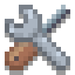

# Mia

*"Mia is acronymed!"*

A new approach on an app 'n game engine in C.
Supports multiple platforms, as well as mobile apps and mobile friendly web apps!
Mia balances high level object orientated programming with low level access, combining *the best of both worlds...*

> Mia can also be edit, compiled and run directly on an Android device!

The object-oriented library tries to prevent common mistakes, but Mia is nevertheless a **C** engine.
So its expected that *you know what you do*
in a sense that you have to think about the memory management in more complex scenarios,
even if the object-tree-based resource management makes it easier.

## Platforms
The following platforms are currently supported:
- Desktop
  - Windows
  - Ubuntu
- Compiled in the Android App CxxDroid
- Android App
- WebApp

> macOS and iOS are missing, because I don't own a MacBook yet. Should be easy to support as well...

Have a look at the install 'n run docs:
[Install and run Mia](doc/install.md)

## Quick Start
Open the [examples doc](doc/examples.md) to quickly see Mia in action.

The examples also act as a tutorial to read through and are well documented.

> To create your own stuff, use the [src/main.c](src/main.c) **Hello World** entry point

## Modules
Mia is split up into multiple modules, each one having a dependency to the previous.

- **"o"** Object oriented standard library
- **"m"** Math and linear algebra
- **"s"** Sound stuff
- **"r"** Render stuff working on OpenGL(ES|WEB)
- **"a"** App Scenes, user input, logins
- **"u"** Utilities
- **"w"** Widgets: GUI windows, buttons, input fields
- **"x"** Extended stuff like a virtual keyboard or color picker widget

## App Modules
Mia also comes with integrated (optional) app modules.
An App can also be started as full opaque scene on top of another game or app.

- **"ex"** Examples App
  - Step by step and well documented examples
  - Also includes a standalone [tea timer app](https://horsimann.de/tea) 
  - [Examples doc](doc/examples.md)
- **"mp"** Mia Paint
  - Can be started as standalone full app
  - Or with fixed functionality opened from within your own app to let the user paint smth.
  - State: Work in Progress
  - [Mia Paint doc](doc/miapaint.md)

## Author
René Horstmann *aka* Horsimann

## Licence
- The engine and its assets are licenced under MIT, see [LICENSE](LICENSE).
- Uses:
  - [SDL2](https://www.libsdl.org/) (zlib License)
  - [Emscripten](https://emscripten.org/) (MIT License)
  - [curl](https://curl.se/docs/copyright.html) (MIT like License)
  - [sfd](https://github.com/rxi/sfd) for simple file dialogs (MIT License)
  - [microtar](https://github.com/rxi/microtar) for handling .tar archive files (MIT License)
  - [stb_vorbis.c](https://github.com/nothings/stb) to load .ogg sound files (MIT License)
