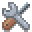

# Examples
Back to [README](../README.md)

Mia is bundled together with multiple App Modules.
One of these is the example app "ex".

The examples are all single self-contained source files and act as tutorials.

## Live Demo
Check out the compiled [live web demo](https://horsimann.de/mia) while surfing through the files!  

## List of examples

> Please follow the examples one by one to get to learn the basic concepts of mia :)

- [00_hello_world](../src/ex/ex_00_hello_world.c)
  - Draws a simple rotating mia icon
- [01_pointers](../src/ex/ex_01_pointers.c)
  - Draws a batch of colored quads, that can be grabbed
- [02_animations](../src/ex/ex_02_animations.c)
  - Draws an animated candle and a text
- [03_iui](../src/ex/ex_03_iui.c)
  - Immediate user interface for setting variables in runtime
- [04_widgets](../src/ex/ex_04_widgets.c)
  - Introduction to Mia's gui library
- [05_windows](../src/ex/ex_05_windows.c)
  - More about the gui library
- [06_sound](../src/ex/ex_06_sound.c)
  - Load, mix and save sounds
- [07_xtras](../src/ex/ex_07_xtras.c)
  - stuff from module "x" like a file picker
- [08_fetching](../src/ex/ex_08_fetching.c)
  - HTTP request and json reading
- [09_upndownload](../src/ex/ex_09_upndownload.c)
  - Upload and download files from the user

> To create your own stuff, use the [src/main.c](src/main.c) entry point

## Tea timer app

Single file and well documented mini app.
[tea.c](../src/ex/tea.c)

> Here's the [tea timer web app](https://horsimann.de/tea)

## Disabling example compilation

For production, you can disable the examples app (and all other App Modules) 
in the [CMakeLists.txt](../CMakeLists.txt) file

Back to [README](../README.md)